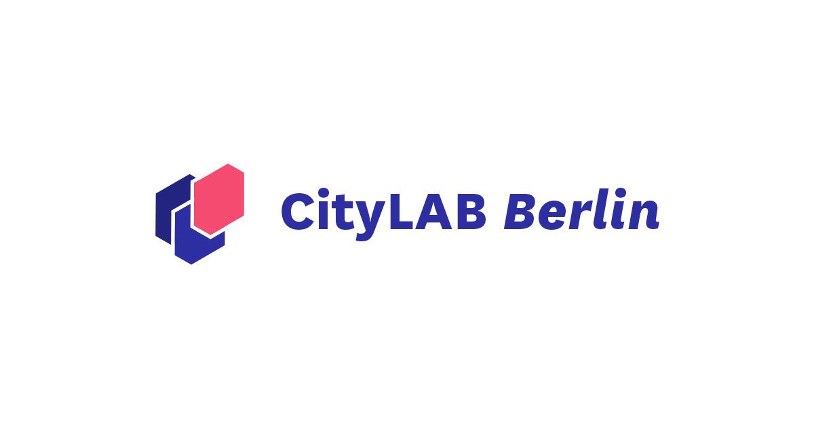

# summerschool24

<!--
*** Thanks for checking out the Best-README-Template. If you have a suggestion
*** that would make this better, please fork the repo and create a pull request
*** or simply open an issue with the tag "enhancement".
*** Don't forget to give the project a star!
*** Thanks again! Now go create something AMAZING! :D
-->

<!-- PROJECT SHIELDS -->
<!--
*** I'm using markdown "reference style" links for readability.
*** Reference links are enclosed in brackets [ ] instead of parentheses ( ).
*** See the bottom of this document for the declaration of the reference variables
*** for contributors-url, forks-url, etc. This is an optional, concise syntax you may use.
*** https://www.markdownguide.org/basic-syntax/#reference-style-links
-->
<!-- PROJECT LOGO -->
 

  

  <h3 align="center">Summerschool 2024</h3>

<!-- ABOUT THE PROJECT -->
## About The Project

Dieses Projekt wurde als Projekt der HTW Berlin und HWR Berlin erstellt.
Es gab mehrere Challenges welche vorgestellt wurden, dieses Repository bezieht sich auf Challenge 2 

Die Herausforderung für Challenge 2 ist es, die von Berlin angebotenen Dienstleistungen und Bürokratischen Hürden, für Personen mit schlechten oder keinen Deutschkenntnissen und wenig Informationen zur deutschen Bürokratie näher zu bringen. 

Wir haben uns vor allem um folgende Probleme gekümmert:
* Intransparenter Durchblick von bürokratischen Prozessen für die Einbürgerung & Integration für Migrant*innen
* Sprachbarrieren und fehlende Unterstützung bei den Prozessen
* Bedarf: Benutzerfreundlichkeit, Mehrsprachigkeit und Barrierefreiheit der Online Dienste

### Built With

Hier zeigen wir mit welchen Sprachen wir gearbeitet haben:

* [![Vue][Vue.js]][Vue-url]
* [![Python][Python.js]][python-url]

(<a href="#readme-top">back to top</a>)

<!-- GETTING STARTED -->
## Generelle Informationen

### Informationen zum ermitteln der Kategorien:

In dem Ordner summerschool24/Kategorien_ermitteln liegen alle verwendeten Dateien zum automatischen ermitteln der besten Kategorien.

Über die Datei scraper.ipynb wurden zuerst die Inhalte der Websiten der Berlins Top 100 Dienstleistungen von der service.berlin.de Seite entnommen.
Anschließend wurden diese Informationen in der Datei TF-IDF.ipynb weiterverarbeitet.
Dazu wurde die TF-IDF Methode (Term Frequency - Inverse Document Frequency) verwendet.
Die Kategorien wurden ermittelt und anschließend in Finale_CSV_mit_IDF-Spalte.csv abgespeichert.
Bei einer abschließenden Kontrolle haben wir leider festgestellt, dass die Kategorien teilweise nicht korrekt belegt sind.
Dies liegt an dem Fine-Tuning des Modells, welches wir Aufgrund der begrenzten Zeit nicht ausführlicher durchführen konnten.
Deswegen haben wir uns für eine, manuell Finegetunete Kategorisierung entschieden.

### Flowise
In dem Ordner summerschool24/Flowise befinden sich alle Vorlagen für das Progamm Flowise.

Hier liegen die Vorlagen für Flowise, welche nach der Installation hochgeladen werden können und als Template für einen Chatbot dienen können.
Auch sind die PDF Formulare, zu welchem Fragen durch den Chatbot beantwortet werden können, dort vorhanden.
Bei unseren Tests haben wir zuerst Llama3.1 verwendet, 
haben leider aber feststellen müssen, dass Geminipro für diesen Anwendungsfall qualitativ höhere Antworten geben kann.

### Website
Abschließend sind den in restlichen Ordnern die Dateien für unsere erstellte Website.
Die Website wurde mithilfe des VUE Frameworks erstellt.

### Prerequisites

Zum installieren der nötigen Module muss zuerst
* npm install

Ausgeführt werden.
Anschließend kann mit

* npm run dev

Die Website gestartet werden.

<!-- USAGE EXAMPLES -->
## Weiteres Vorgehen

Durch die Zeitbegrenzung im Projekt konnten wir leider nicht alle Ziele erreichen, wie auch in der Roadmap angegeben.
Die Liste der möglichen Features kann man auch noch Erweitert werden und ausgebaut werden.

(<a href="#readme-top">back to top</a>)

<!-- ROADMAP -->
## Ziele des Projekts

- [x] Kategorien der Top 100 Dienstleistungen mithilfe von TF-IDF ermitteln
    - [x] Manuelles Fine Tuning
- [x] Erstellen der Formularhilfe
- [ ] Multiple Sprachunterstützung
- [x] Chatbot für Nachfragen
- [ ] Features auf Website integrieren
    - [x] Explorative Suche durch Kacheln
        - [x] Kategorien von allen Dienstleistungen ermitteln
    - [ ] Chatbot integrieren
    - [x] Digitalisierung von exemplarischem Formular
         - [ ] Digitalisierung von allen Formularen
    - [ ] Suchleiste um Dienstleistungen zu finden
    - [ ] "Leute klickten auch"-Vorschläge auf den Dienstleistungsseiten
 

(<a href="#readme-top">back to top</a>)

<!-- CONTACT -->
## Contact

* Tunay Eken      - Tunay.Eken@student.htw-berlin.de
* Jan Lüken       - Jan.Lueken@student.htw-berlin.de
* Thien Nguyen    - Thien.Nguyen@student.htw-berlin.de
* Lea Rothbauer   - Lea.Rothbauer@HWR-berlin.de

<!-- MARKDOWN LINKS & IMAGES -->
<!-- https://www.markdownguide.org/basic-syntax/#reference-style-links -->
[python-url]: https://www.python.org/
[python.js]: https://img.shields.io/badge/python-3670A0?style=for-the-badge&logo=python&logoColor=ffdd54
[Vue.js]: https://img.shields.io/badge/Vue.js-35495E?style=for-the-badge&logo=vuedotjs&logoColor=4FC08D
[Vue-url]: https://vuejs.org/
